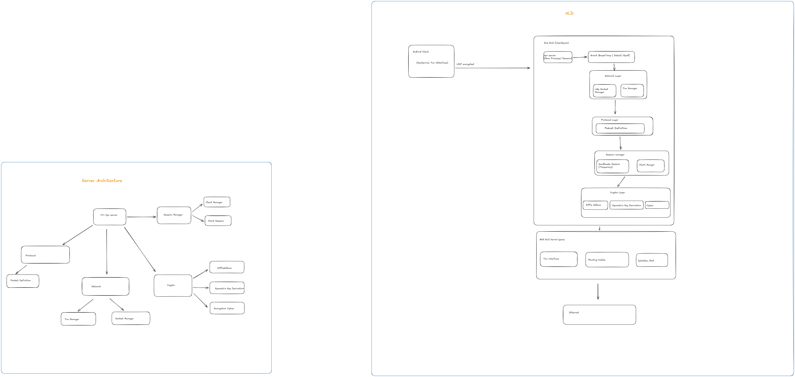

# Cpp-VPN-Core: High-Performance Linux Tunneling Engine

A Linux-native VPN core built for low-latency packet processing and high-throughput networking. This engine implements a custom UDP-based protocol focused on syscall efficiency, architectural resilience, and session persistence.



## 🛠 High-Level Engineering Overview

Cpp-VPN-Core is a systems-level networking engine designed to maximize packet-per-second (pps) performance on Linux. By leveraging modern kernel interfaces and a zero-allocation packet pipeline, it minimizes the overhead traditionally associated with userspace tunneling.


### 🚀 Core Performance Optimizations
* **Syscall Batching (recvmmsg/sendmmsg):** Optimized the I/O pipeline to significantly reduce the cost of kernel-to-userspace context switches by processing multiple datagrams in a single system call.
* **Low-Latency Profiling:** Integrated **RDTSC-based cycle counting** for precise measurement of decryption and lookup costs, enabling data-driven optimization of the packet pipeline.
* **Non-Blocking I/O Multiplexing:** Utilizes `select()` and non-blocking sockets to manage multiple client streams within a single-threaded high-speed loop.
* **Zero-Allocation Mentality:** Designed for minimal heap fragmentation, focusing on in-place memory manipulation during packet decryption and routing.

### 🏗 Architectural Features
* **Stateless Session Roaming:** Decouples a client's tunnel identity from their network identity using a persistent **32-bit Session ID**. This enables seamless "Roaming"—the ability to maintain a VPN connection across IP/Port changes (e.g., Wi-Fi to 4G) without re-handshaking.
* **Virtual IP Pool Management:** Implements an internal **IP Reservation and Lifecycle System** for assigning and recycling internal VPN addresses.
* **Custom Protocol Handshake:** A 3-step handshake utilizing **Diffie-Hellman (DH)** key exchange for secure, per-session XOR key derivation.

---

## 📐 System Flow & Logic

### 1. The Handshake Protocol
The handshake ensures perfect forward secrecy for the session key before any data traffic is accepted.


### 2. Traffic Processing Loop
Incoming UDP packets are parsed for their custom **5-byte header** to determine if they are control signals or encrypted data.


---

## 📊 Performance Metrics
*Calculated using integrated RDTSC profiling on Linux x86_64.*

| Operation | Metric |
| :--- | :--- |
| **I/O Strategy** | `recvmmsg` / `sendmmsg` (Batching) |
| **Max Batch Size** | 8 Packets per Syscall |
| **Profiling Method** | Serialized RDTSC (Cycle Accurate) |
| **Routing Strategy** | Session ID-based Roaming |

---

## 🛠 Technical Stack
* **Language:** C++17 (Focus on performance and RAII)
* **Build System:** CMake (With modular profiling toggles)
* **Network Interfaces:** Linux TUN/TAP, UDP Sockets
* **Cryptography:** Diffie-Hellman Key Exchange, Custom XOR Stream Cipher
* **System Utilities:** `recvmmsg`, `sendmmsg`, `fcntl`, `ioctl`

---

## ⚙️ Building the Core

```bash
# Clone and build
./script/runbuild.sh
```

# Execution (Requires root for TUN device creation)
sudo ./vpn_server
---

## 📫 Professional Contact
For technical inquiries, architectural review, or professional collaboration

Repository: shivesh1606/Cpp-VPN-Core

LinkedIn: https://www.linkedin.com/in/shivesh-chaturvedi-14ab321b3/

Email: shivesh.dev.projects@gmail.com

## ⚖️ License

This project is licensed under the **Apache License, Version 2.0**. 

The Apache 2.0 license is a permissive license that allows for the use, modification, and distribution of the software, provided that the original copyright notice and disclaimers are preserved. It also includes an explicit grant of patent rights from contributors to users.

For the full legal text, please see the [LICENSE](LICENSE) file.