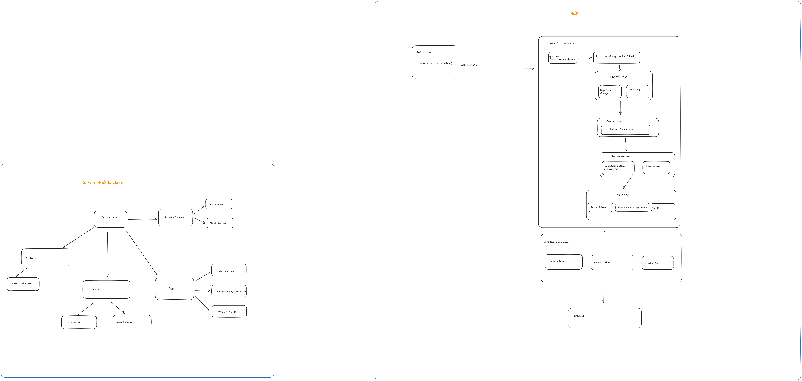

# Cpp-VPN-Core: High-Performance Linux Tunneling Engine

A custom UDP-based VPN engine with a Linux server and a Windows native client. Built for low-latency packet processing using syscall batching, session roaming, and DH-derived per-session encryption.



---

## Architecture Overview

```
[ Windows Client ]  <──── UDP/5555 (XOR encrypted) ────>  [ Linux Server ]
  Wintun TUN adapter                                         TUN device (tun0)
  clients/windows/                                           main.cpp
```

The server runs on Linux and manages multiple clients. The Windows client connects, completes a 3-step Diffie-Hellman handshake, receives a virtual IP, and begins routing traffic through the tunnel.

---

## Protocol

All packets share a 5-byte header: `type (1 byte) | session_id (4 bytes)`.

| Type | Name | Direction | Purpose |
|---|---|---|---|
| 1 | `PKT_HELLO` | Client → Server | Start handshake, send DH public value |
| 2 | `PKT_WELCOME` | Server → Client | Assign VPN IP + server DH public value |
| 3 | `PKT_CLIENT_ACK` | Client → Server | Complete handshake |
| 4 | `PKT_DATA` | Both | XOR-encrypted IPv4 payload |
| 5 | `PKT_BYE` | Client → Server | Graceful disconnect |
| 6 | `PKT_KEEPALIVE` | Client → Server | Heartbeat (sent every 30s) |

### Handshake Flow

```
Client                          Server
  |                               |
  |── PKT_HELLO (yc, magic) ────>|  Server stores pending session
  |                               |
  |<── PKT_WELCOME (ys, VPN IP) ─|  Server sends DH public value + assigned IP
  |                               |
  |── PKT_CLIENT_ACK ───────────>|  Both sides compute shared_secret → XOR key
  |                               |
  |<══ PKT_DATA (encrypted) ════>|  Tunnel active
```

---

## Server (Linux)

### Prerequisites

- Linux (Ubuntu 20.04+ recommended)
- GCC / Clang with C++17
- CMake 3.10+
- Root access (for TUN device creation)

### Build

```bash
# Standard build
./scripts/runbuild.sh

# Manual build with profiling enabled
mkdir -p build && cd build
cmake -DENABLE_PROFILING=ON ..
make -j$(nproc)
```

### Start

```bash
# Requires root — creates tun0, binds UDP :5555
sudo ./build/vpn_server
```

The server:
1. Creates `tun0` TUN interface
2. Binds UDP socket on port `5555`
3. Accepts client handshakes and assigns VPN IPs from the `10.8.0.x/24` pool
4. Prints per-second throughput stats to stdout

### Stop

```bash
# Ctrl+C or
kill -SIGINT <pid>
```

Graceful shutdown — flushes logs, closes TUN and socket.

### Configuration (compile-time)

| Parameter | Location | Default | Notes |
|---|---|---|---|
| VPN IP pool start | `main.cpp:229` | `10.8.0.2` | First assignable client IP |
| Pool size | `main.cpp:229` | `100` | Max concurrent clients |
| UDP port | `main.cpp:237` | `5555` | Server listen port |
| Handshake timeout | `main.cpp:239` | `10s` | Pending session expiry |
| Client dead timeout | `main.cpp:240` | `60s` | Idle client sweep interval |
| RX batch size | `main.cpp:33` | `8` | Packets per `recvmmsg` call |
| TX batch size | `main.cpp:35` | `3` | Packets per `sendmmsg` call |

### Profiling

Pass `-DENABLE_PROFILING=ON` to CMake to enable RDTSC cycle counters. Per-second stats will include cycles/packet for encrypt, decrypt, lookup, TUN read/write, and syscalls.

---

## Windows Client

### Prerequisites

- Windows 10/11 (64-bit)
- **Visual Studio 2019+** (with "Desktop development with C++" workload) **or** MinGW-w64
- CMake 3.10+
- `wintun.dll` — already bundled in `clients/windows/`
- **Must run as Administrator** (Wintun requires it to create the virtual adapter)

### Build

**Option A — MSVC (Visual Studio)**

```cmd
cd clients\windows
cmake -B build -G "Visual Studio 17 2022" -A x64
cmake --build build --config Release
```

Binary output: `clients\windows\build\Release\vpn_client.exe`

**Option B — MinGW**

```cmd
cd clients\windows
cmake -B build -G "MinGW Makefiles" -DCMAKE_BUILD_TYPE=Release
cmake --build build
```

Binary output: `clients\windows\build\vpn_client.exe`

> `wintun.dll` is automatically copied next to the executable by the CMake post-build step.

### Start

Open **Command Prompt or PowerShell as Administrator**, then:

```cmd
# Connect to server on default port 5555
.\vpn_client.exe <server_ip>

# Specify port explicitly
.\vpn_client.exe <server_ip> 5555

# Example
.\vpn_client.exe 192.168.1.100 5555
```

What happens on start:
1. Sends `PKT_HELLO` to server with DH public value (up to 4 retries, 5s each)
2. Receives `PKT_WELCOME` — server assigns a VPN IP (e.g. `10.8.0.2`) and its DH public value
3. Both sides derive the same XOR key from the shared DH secret
4. Sends `PKT_CLIENT_ACK` — tunnel is now active
5. Creates a `MyVPN` Wintun adapter and assigns the VPN IP via Windows IP Helper API
6. Enters event loop: routes traffic between the Wintun adapter and the encrypted UDP tunnel
7. Sends `PKT_KEEPALIVE` to the server every 30 seconds

### Stop

```
Ctrl+C
```

On Ctrl+C the client:
1. Sends `PKT_BYE` to the server (server removes the session and frees the VPN IP)
2. Closes the Wintun session and adapter
3. Cleans up the socket

### Verify the tunnel is working

After connecting, open a new terminal and check:

```cmd
# Your assigned VPN IP should appear
ipconfig | findstr "10.8.0"

# Check your public IP routes through the server
curl ifconfig.me
```

---

## Performance

*Measured with RDTSC profiling on Linux x86_64.*

| Metric | Value |
|---|---|
| I/O Strategy | `recvmmsg` / `sendmmsg` batching |
| Max RX batch | 8 packets per syscall |
| Max TX batch | 3 packets per syscall |
| Client event loop | `WaitForMultipleObjects` (zero busy-wait) |
| Server event loop | `select()` non-blocking |
| Profiling method | Serialized RDTSC (cycle-accurate) |
| Routing strategy | Session ID-based roaming (survives IP/port change) |

---

## Technical Stack

| Component | Technology |
|---|---|
| Language | C++17 |
| Build system | CMake |
| Server TUN | Linux TUN/TAP (`/dev/net/tun`) |
| Client TUN | Wintun (Windows kernel driver) |
| Crypto | Diffie-Hellman key exchange + XOR stream cipher |
| Server I/O | `recvmmsg`, `sendmmsg`, `select()` |
| Client I/O | `WaitForMultipleObjects`, `WSAEventSelect` |
| IP assignment | Server-side pool (`10.8.0.x/24`), Windows IP Helper API on client |

---

## Repository Structure

```
.
├── main.cpp                        # Linux server entry point + main loop
├── CMakeLists.txt                  # Linux server build
├── build.ps1                       # Windows PowerShell: Docker build + GCP deploy
├── clients/
│   └── windows/
│       ├── main.cpp                # Windows VPN client
│       ├── CMakeLists.txt          # Windows client build
│       ├── wintun.h                # Wintun API header
│       └── wintun.dll              # Wintun driver (bundled)
├── crypto/
│   ├── DiffieHellman.h/.cpp        # DH key exchange (P=127, G=9)
│   ├── XorCipher.h/.cpp            # XOR stream cipher (singleton)
│   └── KeyDerivation.h/.cpp        # Key derivation helpers
├── protocol/
│   └── Handshake.h/.cpp            # Packet type definitions and structs
├── net/
│   ├── tun/TunDevice.h/.cpp        # Linux TUN device management
│   └── socket/SocketManager.h/.cpp # UDP socket creation
├── sessions/
│   ├── client/Client_Manager.h/.cpp  # Connected client state + IP pool
│   └── session/ClientSession.h/.cpp  # Pending handshake state
├── utils/
│   ├── logger.h/.cpp               # Log levels + file/stderr output
│   ├── profiling.h                 # RDTSC macros (gated by ENABLE_PROFILING)
│   └── counter_definition.h/.cpp  # Stats struct + per-second reporting
└── scripts/
    ├── runbuild.sh                 # Linux build script
    └── analyze_vpn_log.py          # Log analysis tool
```

---

## Contact

Repository: [shivesh1606/Cpp-VPN-Core](https://github.com/shivesh1606/Cpp-VPN-Core)

LinkedIn: https://www.linkedin.com/in/shivesh-chaturvedi-14ab321b3/

Email: shivesh.dev.projects@gmail.com

## License

Licensed under the **Apache License 2.0** — see [LICENSE](LICENSE) for the full text.
